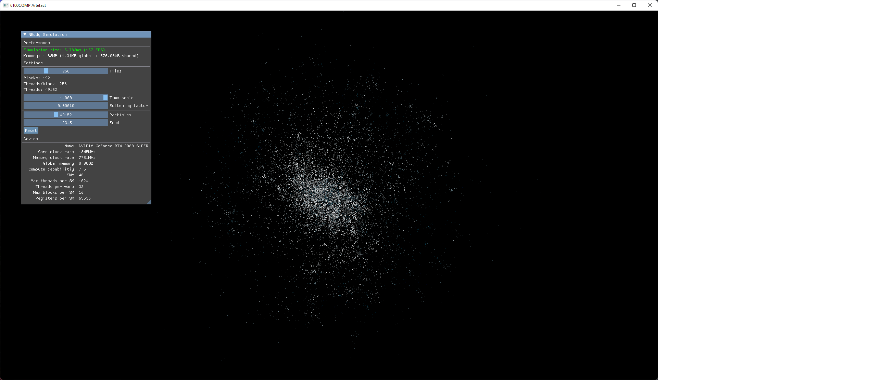

# CUDA N-Body Simulation
Gravitational N-Body simulation of particles accelerated with data parallelism using CUDA. Developed for my University dissertation *An Exploration of Parallel Computer Architecture and GPGPU Computing*.
Particles are rendered as points using DirectX 11/Hieroglyph3. Some paramaterisation of the simulation is exposed via a simple ImGui interface.
